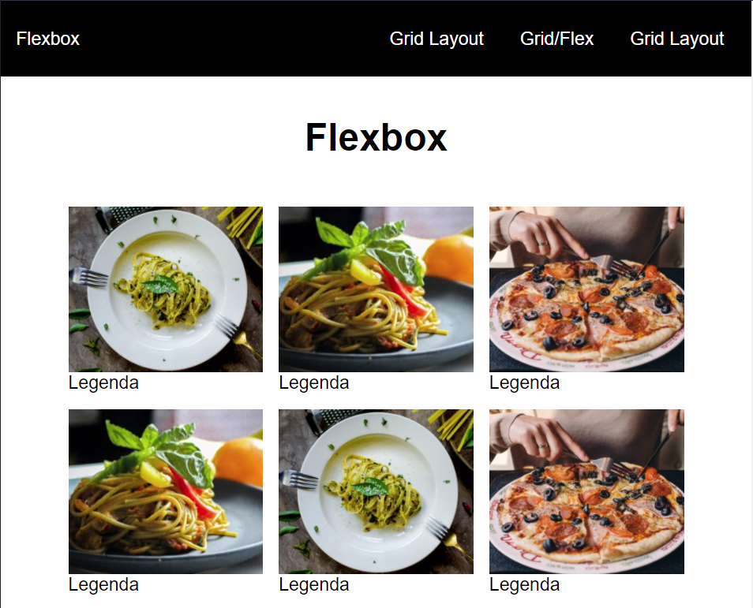

<h1 align="center"> Study on Flexbox/Grid Layout </h1> 
<p align="center">


</p>

### Overview
<p>
Small project designed to improve my knowledge of some CSS3 features such as Flex-Box and Grid Layout.
It's a simple project, however, with a lot of content on the CSS part.
</p>

### 👀 Prerequisites

Before starting, you will need to have the following tools installed on your machine:<br/>
[Git](https://git-scm.com) and a code editor like [VSCode](https://code.visualstudio.com/).

### 🎲 Running the Project

```bash
# Clone este repositório
$ git clone <https://github.com/Arthur-Ferreira/Css_Flexbox_Gridlayout_Exercise>

# Acesse a pasta do projeto no terminal/cmd
$ cd css_flex_box_grid_layout

# Abra a pasta com os arquivos html
$ cd views

# Abra os arquivos no navegador
$ start .\{nomeDoArquivo}
```

### 🛠 Technologies

The following tools were used in the construction of the project:

- [HTML5](https://developer.mozilla.org/pt-BR/docs/Web/HTML)
- [CSS3](https://developer.mozilla.org/pt-BR/docs/Web/CSS)


<h4 align="center"> 
	🚀 Project completed 🚀
</h4>

Made with 🖤 by ARTHUR FERREIRA [see my linkedin](https://www.linkedin.com/in/arthur-ferreira-492680153/)